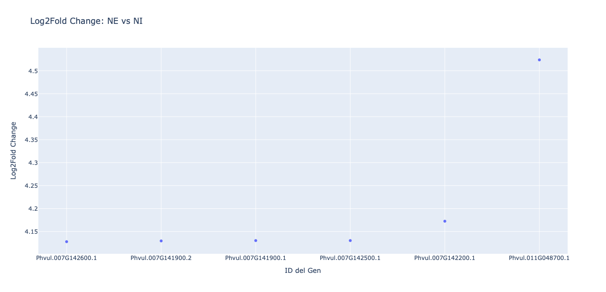
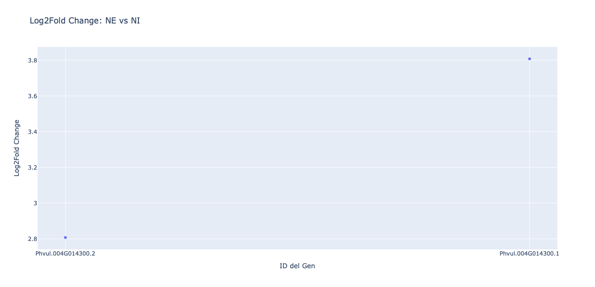

# Nodulacion en *Phaseolus vulgaris*

Nombre: Daniel Bautista (<danielzb@lcg.unam.mx>)  
Nombre: Palma Melissa (<melissap@lcg.unam.mx>) 

Fecha:  10/09/2024

## Introducción

El frijol común (*Phaseolus vulgaris*) es una de las leguminosas más importantes a nivel mundial, representando 
alrededor del 50% del consumo global de leguminosas de grano. Su importancia es particularmente notable en América
Latina y África, donde constituye un componente esencial de las dietas tradicionales. Además de ser una fuente valiosa
de proteínas dietéticas, con un contenido que oscila entre el 20% y el 25%, el frijol común también es rico en 
micronutrientes y calorías, lo que lo convierte en un alimento fundamental para millones de personas. 

Adicionalmete las legumbres son contribuyentes importantes al nitrógeno biológico (N), un nutriente critico  
para la produccion y crecimiento, este nutriente a pesar de su abundacia atmosferica las plantas solo pueden 
utilizar formas reducidas de este elemento, como el amonio (NH₄⁺) o los nitratos (NO₃⁻). La fijación de nitrógeno
atmosférico es posible gracias a la acción de bacterias específicas, algunas de las que fijan nitrógeno de manera 
simbiótica, asociándose con plantas huéspedes, como las legumbres, que les suministran azúcares provenientes de la
fotosíntesis como fuente de energía, mientras que los microorganismos proporcionan nitrógeno fijado para el crecimiento
de la planta.

En el caso de legumbres como *P.vulgaris* estas bacterias colonizan el sistema de raíces de la planta huésped y 
hacen que las raíces formen nódulos (anaeróbicos) para albergar a las bacterias que empezaron a fijar nitrógeno que la
planta aprovechara para producir semillas ricas en nitrógeno. Siendo las legumbres no noduladas bajas en nitrógeno y 
con una producción baja de semillas.

La fijación e nitrógeno desempeña un papel fundamental en el mantenimiento de la salud de los ecosistemas tanto acuáticos 
como terrestres en todo el planeta, es el estudio de los mecanismos que subyacen a las relaciones simbióticas, la formación 
de nódulos y la fijación de nitrógeno de gran importancia, por ejemplo como una posible alternativa natural para suministrar
este nutriente esencial a las plantas en contraste fertilizantes sintéticos cuyo uso excesivo ha generado serios problemas 
ecológicos a nivel global, como la creación de zonas muertas en áreas costeras. 

## Planteamiento del problema

El frijol común (*Phaseolus vulgaris*) es una leguminosa de gran importancia mundial, tanto en términos de consumo humano como por su capacidad de fijar nitrógeno en simbiosis con bacterias como *Rhizobium tropici* y *Rhizobium giardini*. La fijación de nitrógeno es crítica para el crecimiento y desarrollo de la planta, ya que le permite obtener nitrógeno atmosférico en lugar de depender exclusivamente de fertilizantes externos. Sin embargo, existen diferencias en la eficiencia de esta fijación de nitrógeno dependiendo de la cepa bacteriana que infecte la planta. Se han observado variaciones significativas en las vías de asimilación de nitrógeno, el crecimiento de la planta y la senescencia celular cuando se comparan las infecciones por R. tropici (efectiva) y R. giardini (inefectiva).

Un problema crítico en la mejora de la fijación de nitrógeno y la optimización del crecimiento de las plantas es la falta de un entendimiento profundo sobre cómo diferentes cepas de Rhizobium impactan la expresión génica y, en consecuencia, el metabolismo del nitrógeno y la senescencia celular. Aunque *R. tropici* es conocido por ser efectivo en la fijación de nitrógeno, la infección con *R. giardini* provoca envejecimiento prematuro de los tejidos, posiblemente relacionado con la senescencia celular. Esto afecta negativamente el rendimiento de la planta. Además, la función de proteínas como la leghemoglobina, que se ha asociado principalmente a los nódulos, en otras partes de la planta, como los meristemos apicales, sigue sin estar completamente aclarada.

El éxito del frijol como fuente agrícola sostenible depende en gran medida de mejorar la fijación biológica de nitrógeno y gestionar mejor la senescencia inducida por infecciones ineficaces. Al analizar comparativamente la expresión génica en plantas infectadas con *R. tropici* y *R. giardini*, es posible identificar los mecanismos moleculares responsables de estas diferencias. Además, al explorar el papel de la leghemoglobina en otras partes de la planta, como los meristemos apicales, y comparando estos datos con especies relacionadas, se podría esclarecer su rol en procesos de crecimiento y desarrollo fuera de los nódulos. También se busca entender cómo el envejecimiento prematuro puede afectar la salud celular y el ciclo de vida de las plantas.

## Objetivos:

**Analizar comparativamente los genes que se expresan a consecuencia de la infección por R.Tropici y R.Giardini, y sus consecuencias en vías dependientes a Nitrogeno y el crecimiento**

**Analizar la expresión de leghemoglobina en el tallo para discernir su papel en las raíces**

**Analizar el efecto del envejecimiento prematuro en los tejidos y juzgar si estos afectan la senescencia celular**

Este conocimiento podría ayudar a diseñar estrategias que mejoren la fijación de nitrógeno y mitiguen los efecto del crecimiento atrofiado, mejorando el rendimiento del frijol y reduciendo la dependencia de fertilizantes nitrogenados.

## Metodología

Se descargaron los datos del repositorio *Phaseolus vulgaris* gene expression atlas (PvGEA) disponible en: (<https://www.zhaolab.org/PvGEA/>)
y publicado en el articulo: `An RNA-Seq based gene expression atlas of the common bean`

Los datos de entrada consisten los genes diferencialmente expresados entre distintas condiciones de inoculacion en los nodulo. Los archivos con los datos se encuentras en formato xlsx.

### A. Datos de Entrada 

Los datos de entrada fueron descargados desde (<https://www.zhaolab.org/PvGEA/>) y se encuentran en `proyecto_biopython/data`

```
|-- data
|   |-- N5vsNE.xlsx
|   |-- NEvsNI.xls
```

#### Metadatos de la carpeta de datos

> Fecha de descarga: 08/09/2024

>| Archivo | Descripción  | Tipo | 
|:--      |:--           |:--  |
|  N5vsNE.xlsx | Contiene datos de expresión génica comparando las condiciones N5 y NE| Formato xlsx |
|  NEvsNI.xls | Contiene datos de expresión génica comparando las condiciones NE y NI | Formato xlsx |

#### Formato de los archivos

- N5vsNE.xlsx: formato xlsx

> a. Posee una unica hoja de calculo que esta estructuradas de la siguiente forma:
    Columnas:
    - GeneID,NE,N5:,FoldChange,Prob DE, PfamID, Pfam_Description, PANTHER_ID, Panther_Description, KOG_ID, KOG_Description, EC_ID, EC_Description, KO_ID, KO_Description, GO_ID, GO_Description, Transcription Factor Family, Gmax_BLASTN_TopHit, Gmax_BLASTN_TopHit_Evalue, Gmax_BLASTN_TopHit_%ID, Gmax_BLASTN_Hit2, Gmax_BLASTN_Hit2_Evalue, Gmax_BLASTN_Hit2_%ID, Glyma_BP_GO y Glyma_MF_GO	
    
    Descripción de las columnas mas importantes:
    - GeneID: Identificador del gen, en este caso nombres como Phvul.005G176566.1 (posiblemente genes del frijol común).
    - NE: Número de nódulos fix+ recogidos 21 DAI(days after inoculation)
    - N5: Número de Nódulos de pre-fijación (fix+) recogidos 5 DAI(days after inoculation)
    - FoldChange: Cambio relativo en la expresión génica entre condiciones 

-   NEvsNI.xls : formato xlsx

    Columnas:
    - GeneID, NE, NI, FoldChange, Prob DE, PfamID, Pfam_Description, PANTHER_ID, Panther_Description, KOG_ID, KOG_Description, 	EC_ID,	EC_Description,	KO_ID,	KO_Description, 	GO_ID,	GO_Description, Transcription Factor, Family	Gmax_BLASTN_TopHit	Gmax_BLASTN_TopHit_Evalue	Gmax_BLASTN_TopHit_%ID	Gmax_BLASTN_Hit2	Gmax_BLASTN_Hit2_Evalue,	Gmax_BLASTN_Hit2_%ID, Glyma_BP_GO y Glyma_MF_GO
    Descripción de las columnas mas importantes:
    - GeneID: Identificador del gen, en este caso nombres como Phvul.005G176566.1 (posiblemente genes del frijol común).
    - NE: Número de nódulos fix+ recogidos 21 DAI (days after inoculation)
    - NI: Número de Nódulos Fix- nodules recogidos 21 DAI (days after inoculation)
    - FoldChange: Cambio relativo en la expresión génica entre condiciones 	

#### Preguntas de investigación
> A. ¿Cuáles son los genes que como consecuencia de la infección por R. giardini cambian su expresión, con respecto al control y R. tropici, y cuáles son las consecuencias de estos cambios en las vías dependientes de nitrógeno y el crecimiento?

Respuesta: 

    Genes: 
        - Phvul.001G142000.1 + Desarrollo embrionario
        - Phvul.002G064200.1 + No hay datos
        - Phvul.003G103500.1 + Regulador de transcripción específico de ADN (CCAAT_HAP3).
        - Phvul.003G223600.1 + Actividad de factor de transcripción
        - Phvul.010G031100.1 + Dominio MazG, pirofosfohidrolasa de nucleótidos
        - Phvul.001G225000.1 - Nicotianamina sintasa, involucrada en la biosíntesis de nicotianamina.
        - Phvul.005G083400.1 - Proteína inducida por aluminio.
        - Phvul.007G100800.1 - No hay datos
        - Phvul.008G139900.1 - No hay datos
        - Phvul.011G077900.1 - Hidrolasa, actividad sobre compuestos O-glicosilados, metabolismo de carbohidratos.

El único gen con una conexión potencial con las vías dependientes de nitrógeno es Phvul.001G225000.1 (nicotianamina sintasa), ya que la nicotianamina participa en el transporte de hierro, un cofactor esencial para las nitrogenasas en la fijación de nitrógeno. Su represión podría tener un impacto indirecto negativo en estas vías. Lo cual serviría para explicar parcialmente lo observado en R. giardini, que es ineficiente en la nodulación.

> B. ¿Cuál es el papel de la leghemoglobina en los meristemos apicales?
Respuesta: 
La leghemoglobina es una proteína característica de los nódulos fijadores de nitrógeno en plantas leguminosas, conocida por su capacidad para unir oxígeno; su papel principal está relacionado con la regulación de los niveles de oxígeno en los nódulos, protegiendo la nitrogenasa (enzima clave para la fijación de nitrógeno) de la inactivación por oxígeno.
En la infección por la cepa eficiente R. tropici vemos que es altamente expresada, cuando en R. giardini pasa lo contrario. Esto solo nos deja vislumbrar el papel que tiene la leghemoglobina, y las consecuencias de su ausencia. Que provocan nodulacion defectuosa y crecimiento mas lento 

> C. ¿Cómo afecta el envejecimiento prematuro a los tejidos infectados por R. giardini y qué relación tiene con la expresión de genes asociados a la senescencia celular? ¿Qué relación hay entre la infeccion por R. giardini tiene con la expresión de genes asociados a la senescencia celular? 
Respuesta: 
En el artículo mencionan que algo que se observó fue el envejecimiento prematuro en los tejidos infectados por R. giardini, así que decidimos analizar la relación que tenía esta con genes conocidos de senescencia.
En los datos obtenidos podemos observar que los genes Phvul.004G014300.1 y Phvul.004G014300.2, ambos asociados a proteínas relacionadas con la senescencia celular (según su anotación con el dominio PF06911 "Senescence-associated protein"), muestran una expresión diferencial significativa en respuesta a la infección por Rhizobium giardini (NI).

En R. tropici (NE), los genes relacionados con senescencia tienen niveles de expresión detectables (7 unidades para ambos genes). En R. giardini (NI), se observa una drástica reducción en la expresión: Para Phvul.004G014300.2, la expresión disminuye a 1 unidad (FoldChange = 2.81). Para Phvul.004G014300.1, la expresión es completamente suprimida (0 unidades, FoldChange = 3.81).

La reducción en la expresión de genes asociados con senescencia puede estar relacionada con un mecanismo de respuesta adaptativa en la planta frente a R. giardini. Es posible que la infección por R. giardini induzca la modulación de genes de senescencia para evitar el envejecimiento prematuro de tejidos clave, permitiendo una mayor asignación de recursos metabólicos hacia la respuesta a la infección o el mantenimiento de la homeostasis.

La senescencia celular suele estar ligada al reciclaje de nutrientes, incluidos compuestos nitrogenados, en etapas avanzadas del desarrollo de la planta. La supresión de genes de senescencia podría interferir con el reciclaje eficiente de nitrógeno en los tejidos infectados, impactando indirectamente las vías dependientes de nitrógeno y, posiblemente, el crecimiento vegetal bajo infección por R. giardini.

## Resultados

### A. Analizar comparativamente los genes que se expresan a consecuencia de la infección por R.Tropici y R.Giardini, y sus consecuencias en vías dependientes a Nitrogeno y el crecimiento

Archivo(s): `N5vsNE.xlsx`, `NEvsNI.xlsx`

Algoritmo: Ejecutar un script para analizar los datos

Gráfico:

Solución:

```bash

python .\src\differanaliza.py
```

### B. Analizar la expresión de leghemoglobina en el tallo para discernir su papel en los meristemos apicales

Archivo(s): `N5vsNE.xlsx`, `NEvsNI.xlsx`

Algoritmo: Ejecutar un script para analizar los datos 

Gráfico



Solución: 

```bash
python .\src\leghemoglo.py

```

### C. Analizar el efecto del envejecimiento prematuro en los tejidos y juzgar si estos afectan la senescencia celular

Archivo(s): `N5vsNE.xlsx`, `NEvsNI.xlsx`

Algoritmo: Ejecutar un script para analizar los datos 

Gráfico

Solución: 

```bash
python .\src\senescencia.py

```

## Análisis y Conclusiones
La infección por *Rhizobium giardini* induce cambios significativos en la expresión génica de *Phaseolus vulgaris*, con impacto en vías metabólicas clave. Los genes expresados de forma única sugieren una posible relación con procesos de reciclaje de nitrógeno y la modulación de la senescencia celular. Mientras algunos genes como **Phvul.001G225000.1** y **Phvul.005G083400.1** pueden estar relacionados con el metabolismo de nitrógeno, otros como **Phvul.004G014300.1** y **Phvul.004G014300.2**, asociados a la senescencia, muestran una marcada supresión en su expresión bajo infección por *R. giardini*. Esto sugiere una posible estrategia de la planta para combatir un envejecimiento prematuro causado por la desnutrición y priorizar respuestas adaptativas. Además, la leghemoglobina, tal como describen estudios anteriores, desempeña un papel en los meristemos apicales al facilitar el manejo de oxígeno, manteniendo la homeostasis y promoviendo el desarrollo. Estos hallazgos destacan el impacto dañino de *R. giardini* en la fisiología vegetal.


## Referencias
 [1] O’Rourke, J.A., Iniguez, L.P., Fu, F. et al. An RNA-Seq based gene expression atlas of the common bean. BMC Genomics 15, 866 (2014). https://doi.org/10.1186/1471-2164-15-866
 [2] Wagner, S. C.. (2011) Biological Nitrogen Fixation. Nature Education Knowledge 3(10):15
 [3] Berrabah, F., Benaceur, F., Yin, C., Xin, D., Magne, K., Garmier, M., Gruber, V., & Ratet, P. (2024). Defense and senescence interplay in legume nodules. Plant communications, 5(4), 100888. https://doi.org/10.1016/j.xplc.2024.100888